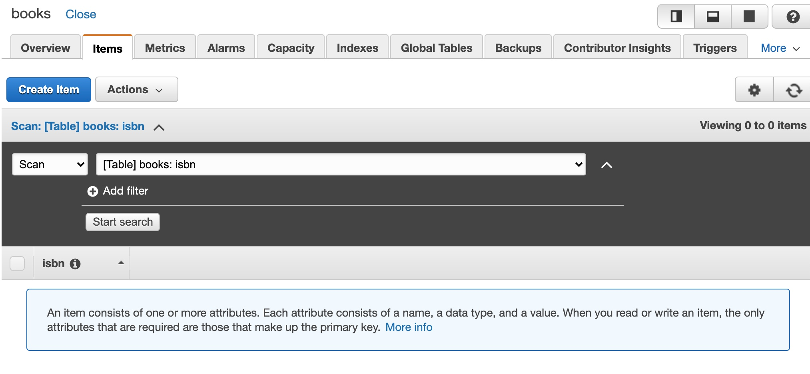
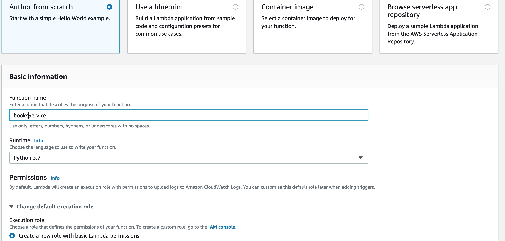
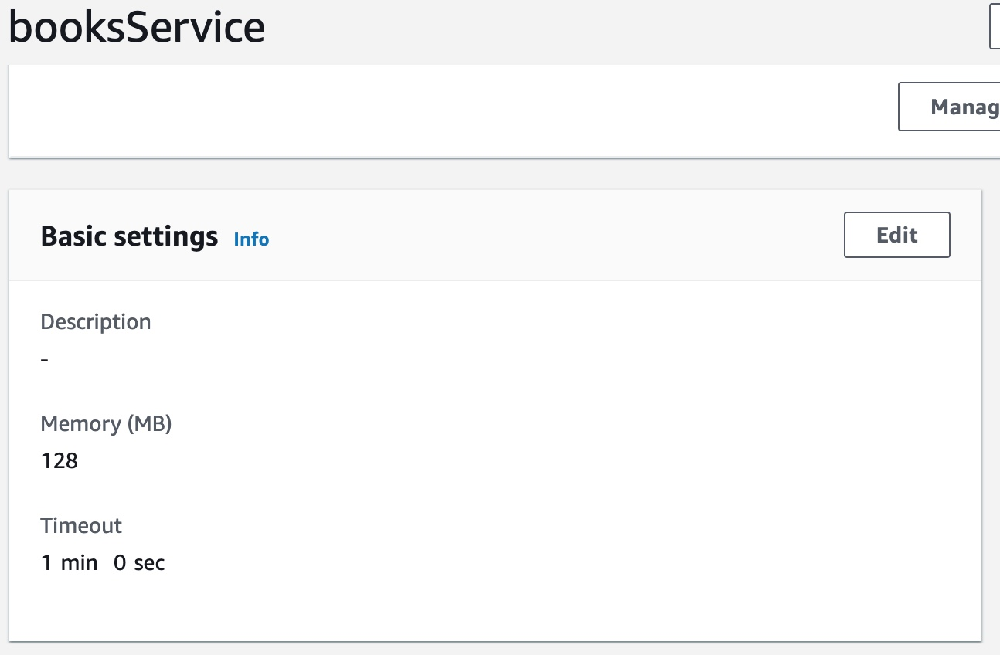
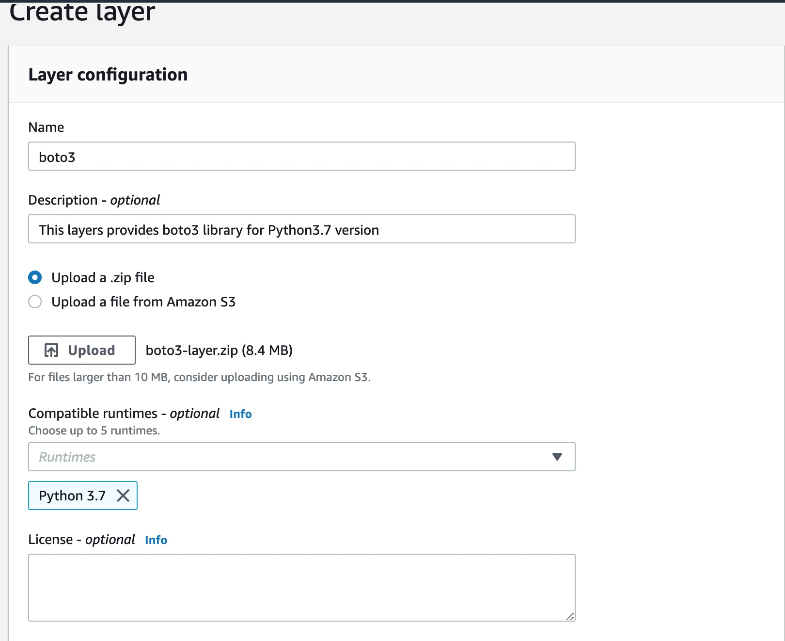
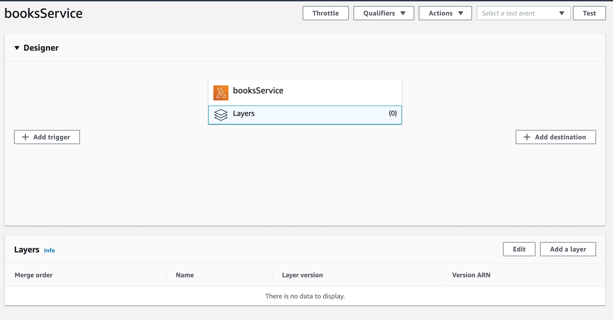
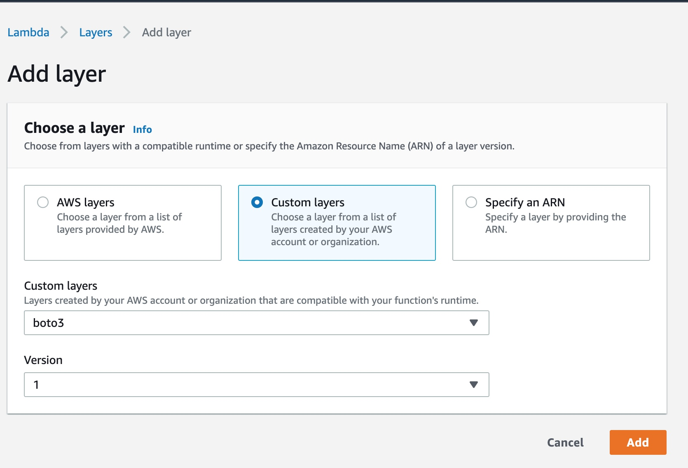
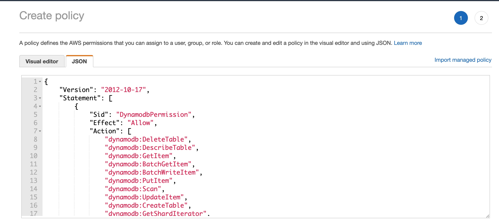
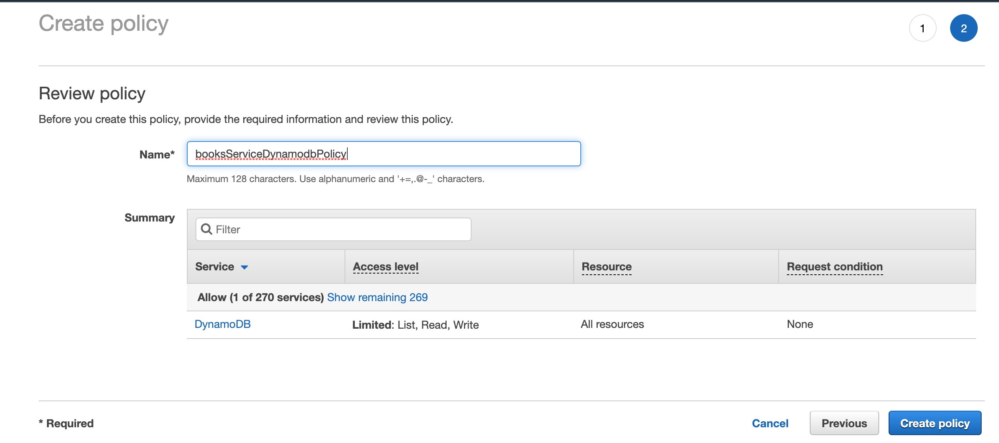
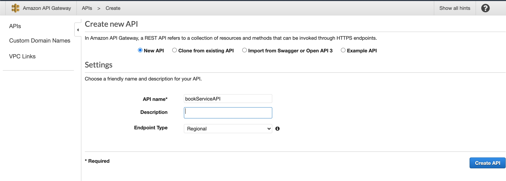
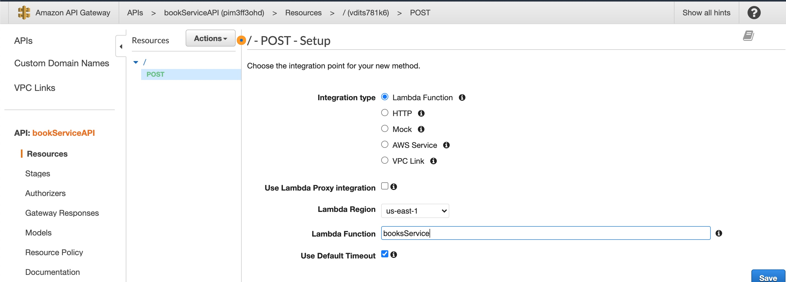

# Serverless-REST-API

In this tutorial, we will build Serverless REST API using many AWS managed services - AWS Lambda, AWS DynamoDB and API Gateway

### Step 1 : Create the dynamodb table
Here I have created a table employee with partition key as book's isbn. Make sure partition key is always unique. DynamoDB uses the partition key value as input to an internal hash function. The output from the hash function determines the partition (physical storage internal to DynamoDB) in which the item will be stored.


### Step 2: Create Lambda Function
Here, I have create booksService lambda function


Edit Basic Settings and set desired Memory and Timeout.



You can create a sample Test Event and add this json to invoke the lambda function
```
{
  "isbn": "9780525434290",
  "author": "Dan Brown",
  "book": "The Origin"
}
```

### Step 3: Create AWS Lambda Layer

You'll need boto3 library to make all the necessary calls to dynamodb, you can choose to use your bundle your package with boto3 library every time you deploy your code, or, you can use AWS Lambda Layers.

Go to AWS Lambda and click on create layer. Upload boto3-layer.zip(in this git repo)


Go back to your lambda function, and select layer, then click on "Add a Layer"


Select Custom Layer, and from the dropdown select boto3 layer that you had just created



### Step 4: Update IAM role to add Dynamodb permissions
Now copy the code in lambda_function.py(in this repo) and paste it in lambda_function.py in lambda function. Let’s discuss about the lambda function example in detail.

This lambda function would get invoked when user calls the bookService API. Once this function gets triggered, the lambda_handler() function gets the event and context objects. This particular lambda lambda_handler() function when invoked adds a book to Dynamodb database.

Click on Deploy.

Now if you try to run the function, it will give you Permission Error with your Dynamodb Table. That happens, because your lambda function does not have permissions to perform put Item operation in Dynamodb, You'll need to update your lambda function's IAM role to add these permissions.

Go to your IAM role, you can find it under `Basic Settings` in your lambda function console.
You can create a new policy or add a new inline policy from your IAM role. 
Paste the policy from `iam-policy.json`





### Step 5: AWS API Gateway Endpoint for POST Request

So now, let’s go to API Gateway on aws console, and hit the button to create API. You will reach a page, and you will need to select the REST(HTTP) protocol, and give a name to the API(bookServiceAPI), like the example below:



After that, you will be directed to the API you have created, and now you can create a POST endpoint for this API on the button Actions-> Create Method. Add your lambda function.



You can test the API you have created in the console, but now we will test it after it’s deployed. So go to Actions -> Deploy API, you can put any deployment stage you want, and you will receive an url. Pick that one and let’s test it in a real HTTP request!

Now grab that URL, and you can use tool like PostMan or Restlet to test your API.

So that’s it, AWS lamdba makes your life so easy when you have to quickly deploy something. Imagine to setting up server, run server init commands, install software and setting up environments, no more this life, all thanks to Lambda function!

I hope that this tutorial was helpful!